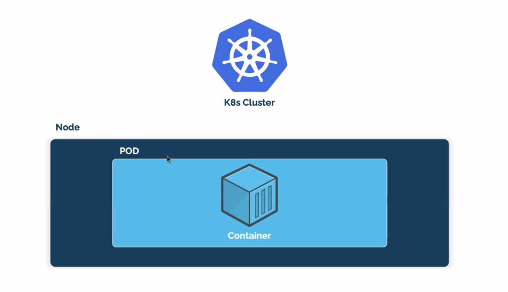
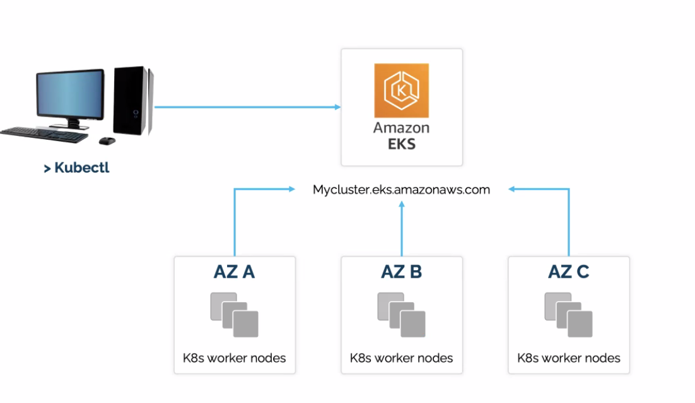

# KUBERNETES-On-AWS
This is my main kubernetes project repo

## Component that made up the Kubernetes
Kubernetes (K8s) - is an open-source system for automating deployment, scaling and management of containerized
applications. (managing containers at scale N)

When you deploy Kubernetes, you get a cluster.

Kubernetes cluster is a group of one or more worker node consists of a set of worker machines, called nodes,that run containerized application.

Worker node(s) host the PODS (containerized app). They are just Server i.e EC2 server 

Control Plane (Master) manages the worker nodes and the pods in the cluster.

# KUBERNETES ARCHITECTURE  


## CONTROL PLANE(MASTER)
This is the brain of kubernetes. He's responsible of sCheduling containers on the worker node. He's the guy that give direction (`ORCHESTRATION`) to each worker node. 

`ON THE MASTER WE HAVE`
1. API SERVER : It's that component in the control plane that allow or manages the comminication between the worker node and the control plane 

2. ETCD (DISTRIBUTED STORAGE): As the is a communication between the Master and the Worker node there are some information that are send between them and need to be store. 
ETCD is just where the contole store all information about the cluster. 

  * This storage is a `key value storage`. It's a Json file. 

3. SCHEDULER: It's just that component that allow the Master to know exactly where to schedule a container. He is responsible of assigning a conatiner to a node. 

  * when a worker node died, K8s will create a new one. And that new worker node doesn't conatian any POPs on it. So, the Scheduler will schedule some pops/conatiners to the new worker node. 

4. REPLICATION CONTROLLER: This is the `AUTO-SCALLING FOR KUBERNETS`. The contol plane will know how to duplicate a container by using a repliacation controller. 

  * All it does is SCALLING `UP` and `DOWN OF CONATAINERS`


## WORKER NODE 
He's the one responsible for managing the containers. That's where your containers live. 

`ON THE WORKER NODE WE HAVE`

1. KUBELET: Is that engibe on the worker node that make sure that the containers is working as expected. 

* The master talk to the `kubelet` to know if the worker node is UP or DOWN. The kubelet is just like the service that tell you wether the conatiner is running or not 

2. CONTAINERS RUNTIME: This is just the plateform you are using on your worker node to run your container and we have been using DOCKER. It's simply installing the container DEMON into the node. 

* There are somany conatiner runtime out there, Docker is just the most popular one

3. PROXY: It's just the networking component, it function must like a `LoadBalancer` that takes the trafic and send to different containers 

It is just there to handle all outside communication between the Master and the Worker node.

As user we don't direvtly interact with the worker node but with the control plane and the controle plane carry that action b default. 


# POP ARCHITECTURE 




Kubernetes on it own doesn't interact directly with the containers. Kubernetes takes you conatiners and encapsulate in another object call the POP. Kubernetes then interact with the POP and the pop indirect with the conatainers. 

# POP 

* Pop is just one or more containers group together that share the same IP space. 
* Pop is the smallest objet you can create in K8s
* Pop is a k8s object that group containers. There are lot of object out the and POP is one of them 
* It's recommented to only have one containers application inside the pop(BEST PRACTICE). 
* Pop is like your `TAGET GROUP`. The `loadbalance` interact directly with the taget group not the ec2 instance. 


A NODE can contain somany POP. 
Only one IP per POP. Every time you wan to scale your application your scale your pop and each POP should only have one application. So your can duplicate your applicaion to somany pop. Depending on the `INSTANCE TYPE OF YOUR APPLICATION. eg t2.micro`


# Amazon Elastic Kubernetes Service (Amazon EKS) 

This is a managed service that you can use to run Kubernetes on AWS without needing to install, operate, and maintain your own Kubernetes control plane or nodes.



## KUBECTL 
Is a K8s `CLI` tool that allow you to communicate with the `CONTROLE PLANE`. It's not only use with EKS it's also use with K8s. Then we install `KUBECTL` by using the following steps below or by going to the official documentation Read [this page](https://docs.aws.amazon.com/eks/latest/userguide/install-kubectl.html) for more information about the syntax to use.

* kubectl A command line tool for working with Kubernetes clusters.

1. To install or update kubectl 
* On macOS
```
curl -O https://s3.us-west-2.amazonaws.com/amazon-eks/1.28.2/2023-10-17/bin/darwin/amd64/kubectl

```
* On Window 
```
curl.exe -O https://s3.us-west-2.amazonaws.com/amazon-eks/1.28.2/2023-10-17/bin/windows/amd64/kubectl.exe

```
* Use the following command to verify if everything was install succesfully 
```
kubectl version --client

```


## EKSCTL

* EKSCTL is an open source and free tool created by Weaveworks .
* eksctl A command line tool for provisioning Kubernetes clusters.It makes the creation, deletion and management of AWS EKS Clusters SUPER EASY! 
* You will need just one command to make your AWS EKS cluster up and running, thanks to AWS CloudFormation laaC service . All you need is to do is to insert some properties (region, number of nodes, the name of your node group) and launch the creation.

### `HOW TO INSTALL EKSCTL ON WINDOW`
1. We first need to install Chocolatey on CLI. Check the official documentation Read [this page](https://docs.chocolatey.org/en-us/choco/setup) for more information

* NB. Don't forget to run your CLI as `ADMINISTRATOR`
```
@"%SystemRoot%\System32\WindowsPowerShell\v1.0\powershell.exe" -NoProfile -InputFormat None -ExecutionPolicy Bypass -Command "[System.Net.ServicePointManager]::SecurityProtocol = 3072; iex ((New-Object System.Net.WebClient).DownloadString('https://community.chocolatey.org/install.ps1'))" && SET "PATH=%PATH%;%ALLUSERSPROFILE%\chocolatey\bin"

```
2. Then we install eksctl using `choco` NB. Don't forget to run your CLI as `ADMINISTRATOR`  
```
choco install eksctl -y

```
3. Test that your installation was succesfull with the following command   
```
eksctl version

```
4. Then you need to download the `zip file` and extract it. 
* NB. Type this link to you web-browser, it will automatically download the zip file for you. 
* This link could be copy when `step 2` is done.  
```
https://github.com/eksctl-io/eksctl/releases/download/v0.164.0/eksctl_Windows_amd64.zip

```